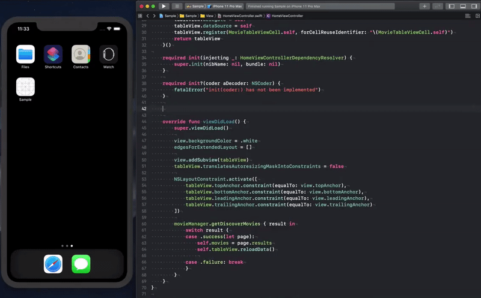

<p align="center">Declarative, easy-to-use and safe Dependency Injection framework for Swift (iOS/macOS/Linux)</p>

[](https://travis-ci.com/scribd/Weaver)
[](https://codecov.io/gh/scribd/Weaver) 
[](https://gitter.im/scribd-weaver/Lobby)

<a href="https://youtu.be/Rxhc9VJBoOI" alt="Watch the demo" target="_blank">
	
</a>

## Features

- [x] Dependency declaration via property wrappers or comments
- [x] DI Containers auto-generation
- [x] Dependency Graph compile time validation
- [x] ObjC support
- [x] Non-optional dependency resolution
- [x] Type safety
- [x] Injection with arguments
- [x] Registration Scopes
- [x] DI Container hierarchy
- [x] Thread safe

## Talks
- [SF SLUG meet-up @Lyft: Maintaining a dependency graph with Weaver](https://www.youtube.com/watch?v=h3CMMbgozG0)

## Tutorials

If you're looking for a step by step tutorial, check out these links.
* [Part 1 - Basics](https://medium.com/scribd-data-science-engineering/dependency-injection-tutorial-with-weaver-on-ios-part-1-78265548dd00)
* [Part 2 - Unit Testing](https://medium.com/scribd-data-science-engineering/dependency-injection-tutorial-with-weaver-on-ios-part-2-5212c716691b)
* Part 3 - Multi target application (coming soon)

## Dependency Injection

Dependency Injection basically means "giving an object its instance variables" [¹](#more-reading). It seems like it's not such a big deal, but as soon as a project gets bigger, it gets tricky. Initializers become too complex, passing down dependencies through several layers becomes time consuming and just figuring out where to get a dependency from can be hard enough to give up and finally use a singleton.

However, Dependency Injection is a fundamental aspect of software architecture, and there is no good reason not to do it properly. That's where Weaver can help.

## What is Weaver?

Weaver is a declarative, easy-to-use and safe Dependency Injection framework for Swift.

- **Declarative** because it allows developers to **declare dependencies via annotations** directly in the Swift code.
- **Easy-to-use** because it **generates the necessary boilerplate code** to inject dependencies into Swift types.
- **Safe** because **it's all happening at compile time**. If it compiles, it works.

## How does Weaver work?

```
                                                                         |-> validate() -> valid/invalid 
swift files -> scan() -> [Token] -> parse() -> AST -> link() -> Graph -> | 
                                                                         |-> generate() -> source code 

```

Weaver scans the Swift sources of the project, looking for annotations, and generates an AST (abstract syntax tree). It uses [SourceKitten](https://github.com/jpsim/SourceKitten) which is backed by Apple's [SourceKit](https://github.com/apple/swift/tree/master/tools/SourceKit).

The AST then goes through a linking phase, which outputs a dependency graph.

Some safety checks are then performed on the dependency graph in order to ensure that the generated code won't crash at runtime. Issues are friendly reported in Xcode to make their correction easier.

Finally, Weaver generates the boilerplate code which can directly be used to make the dependency injections happen.

## Installation

### (1) - Weaver command

Weaver can be installed using `Homebrew`, `CocodaPods` or manually.

#### Binary form

Download the latest release with the prebuilt binary from [release tab](https://github.com/scribd/Weaver/releases). Unzip the archive into the desired destination and run `bin/weaver`

#### [Homebrew](https://brew.sh)

```bash
$ brew install weaver
```

#### [CocoaPods](https://guides.cocoapods.org)

Add the following to your `Podfile`:

```ruby
pod 'WeaverDI'
```

This will download the Weaver binaries and dependencies in Pods/ during your next pod install execution and will allow you to invoke it via `${PODS_ROOT}/WeaverDI/weaver/bin/weaver` in your Script Build Phases.

This is the best way to install a specific version of Weaver since Homebrew cannot automatically install a specific version.

### [Mint](https://github.com/yonaskolb/Mint)

To use Weaver via Mint, prefix the normal usage with mint run scribd/Weaver like so:

```shell
mint run scribd/Weaver version
```

To use a specific version of Weaver, add the release tag like so:

```shell
mint run scribd/Weaver@1.0.3 version
```

#### Building from source

Download the latest release source code from the [release tab](https://github.com/scribd/Weaver/releases) or clone the repository.

In the project directory, run `brew update && brew bundle && make install` to build and install the command line tool.

#### Check installation

Run the following to check if Weaver has been installed correctly.

```bash
$ weaver swift --help

Usage:

    $ weaver swift

Options:
    --project-path - Project's directory.
    --config-path - Configuration path.
    --main-output-path - Where the swift code gets generated.
    --tests-output-path - Where the test helpers gets generated.
    --input-path - Paths to input files.
    --ignored-path - Paths to ignore.
    --cache-path - Where the cache gets stored.
    --recursive-off
    --tests - Activates the test helpers' generation.
    --testable-imports - Modules to imports in the test helpers.
    --swiftlint-disable-all - Disables all swiftlint rules.
```

### (2) - Weaver build phase

In Xcode, add the following command to a command line build phase: 

```
weaver swift --project-path $PROJECT_DIR/$PROJECT_NAME --main-output-path output/relative/path
```

**Important - Move this build phase above the `Compile Source` phase so that Weaver can generate the boilerplate code before compilation happens.**

## Basic Usage

*For a more complete usage example, please check out the [sample project](./Sample).*

Let's implement a simple app displaying a list of movies. It will be composed of three noticeable objects: 
- `AppDelegate` where the dependencies are registered.
- `MovieManager` providing the movies.
- `MoviesViewController` showing a list of movies at the screen.

Let's get into the code.

**`AppDelegate` with comment annotations**:

```swift
@UIApplicationMain
class AppDelegate: UIResponder, UIApplicationDelegate {

    var window: UIWindow?

    private let dependencies = MainDependencyContainer.appDelegateDependencyResolver()
    
    // weaver: movieManager = MovieManager <- MovieManaging
    // weaver: movieManager.scope = .container
    
    // weaver: moviesViewController = MoviesViewController <- UIViewController
    // weaver: moviesViewController.scope = .container
    
    func application(_ application: UIApplication, didFinishLaunchingWithOptions launchOptions: [UIApplicationLaunchOptionsKey: Any]?) -> Bool {
        
        window = UIWindow()

        let rootViewController = dependencies.moviesViewController
        window?.rootViewController = UINavigationController(rootViewController: rootViewController)
        window?.makeKeyAndVisible()
        
        return true
    }
}
```

`AppDelegate` registers two dependencies:
- `// weaver: movieManager = MovieManager <- MovieManaging`
- `// weaver: moviesViewController = MoviesViewController <- UIViewController`

These dependencies are made accessible to any object built from `AppDelegate` because their scope is set to `container`:
- `// weaver: movieManager.scope = .container`
- `// weaver: moviesViewController.scope = .container`

A dependency registration automatically generates the registration code and one accessor in `AppDelegateDependencyContainer`, which is why the `rootViewController` can be built:
- `let rootViewController = dependencies.moviesViewController`.

**`AppDelegate` with property wrapper annotations**:

Since Weaver 1.0.1, you can use property wrappers instead of annotations in comments.

```swift
@UIApplicationMain
class AppDelegate: UIResponder, UIApplicationDelegate {

    var window: UIWindow?
    
    // Must be declared first!
    private let dependencies = MainDependencyContainer.appDelegateDependencyResolver()

    @Weaver(.registration, type: MovieManager.self, scope: .container)
    private var movieManager: MovieManaging
	
    @Weaver(.registration, type: MoviesViewController.self, scope: .container)
    private var moviesViewController: UIViewController
    
    func application(_ application: UIApplication, didFinishLaunchingWithOptions launchOptions: [UIApplicationLaunchOptionsKey: Any]?) -> Bool {
        
        window = UIWindow()

        window?.rootViewController = UINavigationController(rootViewController: moviesViewController)
        window?.makeKeyAndVisible()
        
        return true
    }
}
```

- Note how dependencies can be accessed from the `self` instance directly.

- Also note that the dependencies object must be declared and created prior to any other Weaver annotation. **Not doing so would immediately crash the application**. 

- It is possible to use comment and property wrapper annotations in the same type.

**`MovieManager`**:

```swift
protocol MovieManaging {
    
    func getMovies(_ completion: @escaping (Result<Page<Movie>, MovieManagerError>) -> Void)
}

final class MovieManager: MovieManaging {

    func getMovies(_ completion: @escaping (Result<Page<Movie>, MovieManagerError>) -> Void) {
        // fetches movies from the server...
        completion(.success(movies))        
    }
}
```

**`MoviesViewController` with comment annotations**:

```swift
final class MoviesViewController: UIViewController {
    
    private let dependencies: MoviesViewControllerDependencyResolver
    
    private var movies = [Movie]()
    
    // weaver: movieManager <- MovieManaging
    
    required init(injecting dependencies: MoviesViewControllerDependencyResolver) {
        self.dependencies = dependencies
        super.init(nibName: nil, bundle: nil)
    }
    
    override func viewDidLoad() {
        super.viewDidLoad()

        // Setups the tableview... 
        
        // Fetches the movies
        dependencies.movieManager.getMovies { result in
            switch result {
            case .success(let page):
                self.movies = page.results
                self.tableView.reloadData()
                
            case .failure(let error):
                self.showError(error)
            }
        }
    }

    // ... 
}
```

`MoviesViewController` declares a dependency reference: 

- `// weaver: movieManager <- MovieManaging`

This annotation generates an accessor in `MoviesViewControllerDependencyResolver`, but no registration, which means `MovieManager` is not stored in `MoviesViewControllerDependencyContainer`, but in its parent (the container from which it was built). In this case, `AppDelegateDependencyContainer`.

`MoviesViewController` also needs to declare a specific initializer:

- `required init(injecting dependencies: MoviesViewControllerDependencyResolver)`

This initializer is used to inject the DI Container. Note that `MoviesViewControllerDependencyResolver` is a protocol, which means a fake version of the DI Container can be injected when testing.

**`MoviesViewController` with property wrapper annotations**:

```swift
final class MoviesViewController: UIViewController {
    
    private var movies = [Movie]()

    @Weaver(.reference)
    private var movieManager: MovieManaging
    
    required init(injecting _: MoviesViewControllerDependencyResolver) {
        super.init(nibName: nil, bundle: nil)
    }
    
    override func viewDidLoad() {
        super.viewDidLoad()

        // Setups the tableview... 
        
        // Fetches the movies
        movieManager.getMovies { result in
            switch result {
            case .success(let page):
                self.movies = page.results
                self.tableView.reloadData()
                
            case .failure(let error):
                self.showError(error)
            }
        }
    }

    // ... 
}
```

## API

### Code Annotations

Weaver allows you to declare dependencies by annotating the code with comments like `// weaver: ...` or property wrappers like `@Weaver(...) var ...`

It currently supports the following annotations:

#### - Registration

- Adds the dependency builder to the container.

- Adds an accessor for the dependency to the container's resolver protocol.

Example:

```swift
// weaver: dependencyName = DependencyConcreteType <- DependencyProtocol

@Weaver(.registration, type: DependencyConcreteType.self) 
var dependencyName: DependencyProtocol
```
or 

```swift
// weaver: dependencyName = DependencyConcreteType

@Weaver(.registration) 
var dependencyName: DependencyConcreteType
```

- `dependencyName`: Dependency's name. Used to make reference to the dependency in other objects and/or annotations.

- `DependencyConcreteType`: Dependency's implementation type. Can be a `struct` or a `class`.

- `DependencyProtocol`: Dependency's `protocol` if any. Optional, you can register a dependency with its concrete type only.

#### - Reference

Adds an accessor for the dependency to the container's protocol.

Example:
```swift
// weaver: dependencyName <- DependencyType

@Weaver(.reference) 
var dependencyName: DependencyType
```

`DependencyType`: Either the concrete or abstract type of the dependency. This also defines the type the dependency's accessor returns.

#### - Parameter

Adds a parameter to the container's resolver protocol. This means that the generated container needs to take these parameter at initialisation. It also means that all the concerned dependency accessors need to take this parameter.

Example:

```swift
// weaver: parameterName <= ParameterType

@Weaver(.parameter) 
var parameterName: ParameterType
```

#### - Scope

Sets the scope of a dependency. The default scope being `container`. Only works for registrations or weak parameters.

The `scope` defines a dependency lifecycle. Four scopes are available:

- `transient`: Always creates a new instance when resolved.

- `container`: Builds an instance at initialization of its container and lives as long as its container lives.

- `weak`: A new instance is created when resolved the first time and then lives as long as its strong references are living.

- `lazy`: A new instance is created when resolved the first time with the same lifetime than its container.

Example:

```swift
// weaver: dependencyName.scope = .scopeValue

@Weaver(.registration, scope: .scopeValue)
var dependencyName: DependencyType
```

`scopeValue`: Value of the scope. It can be one of the values described above.

#### - Custom Builder

Overrides a dependency's default initialization code.

Works for registration annotations only.

Example:
```swift
// weaver: dependencyName.builder = DependencyType.make

@Weaver(.registration, builder: DependencyType.make) 
var dependencyName: DependencyType
```

`DependencyType.make`: Code overriding the dependency's initialization code taking `DependencyTypeInputDependencyResolver` as a parameter and returning `DependencyType` (e.g. `make`'s signature could be `static func make(_ dependencies: DependencyTypeInputDependencyResolver) -> DependencyType`).

**Warning - Make sure you don't do anything unsafe with the `DependencyResolver` parameter passed down in this method since it won't be caught by the dependency graph validator.**

#### - Configuration

Sets a configuration attribute to the concerned object.

Example:

```swift
// weaver: dependencyName.attributeName = aValue

@Weaver(..., attributeName: aValue, ...) 
var dependencyName: DependencyType
```

##### Configuration Attributes:

- `isIsolated: Bool` (default: `false`): any object setting this to true is considered by Weaver as an object which isn't used in the project. An object flagged as isolated can only have isolated dependents. This attribute is useful to develop a feature wihout all the dependencies setup in the project.

- `setter: Bool` (default: `false`): generates a setter (`setDependencyName(dependency)`) in the dependency container. **Note that a dependency using a setter has to be set manually before being accessed through a dependency resolver or it will crash.** 

- `objc: Bool` (default: `false`): generates an ObjC compliant resolver for a given dependency, allowing it be accessed from ObjC code.

- `escaping: Bool` (default: `true` when applicable): asks Weaver to use `@escaping` when declaring a closure parameter.

#### Using protperty wrappers with parameters:

Types using parameter annotations need to take the said parameters as an input when being registered or referenced. This is particularly true when using property wrappers, because the signature of the annotation won't compile if not done correctly.

For example, the following shows how a type taking two parameters at initialization can be annotated:

```swift
final class MovieViewController {

   @Weaver(.parameter) private var movieID: Int
   
   @Weaver(.parameter) private var movieTitle: String
}
```

And how that same type can be registered and referenced:

```swift
@WeaverP2(.registration)
private var movieViewController: (Int, String) -> MovieViewController

@WeaverP2(.reference)
private var moviewViewController: (Int, String) -> MovieViewController
```

Note that Weaver generates one property wrapper per amount of input parameters, so if a type takes one parameter `WeaverP1` shall be used, for two parameters, `WeaverP2`, and so on.

#### Writing tests:

Weaver can also generate a dependency container stub which can be used for testing. This feature is accessible by adding the option `--tests` to the command (e.g. `weaver swift --tests`).

**To compile, the stub expects certain type doubles to be implemented.**

For example, given the following code:

```swift
final class MovieViewController {
   @Weaver(.reference) private var movieManager: MovieManaging
}
```

The generated stub expects `MovieManagingDouble` to be implemented in order to compile.

Testing `MoviewViewController` can then be written like the following:

```swift
final class MovieViewControllerTests: XCTestCase {

	func test_view_controller() {
		let dependencies = MainDependencyResolverStub()
		let viewController = dependencies.buildMovieViewController()
		
		viewController.viewDidLoad()
		
		XCTAssertEqual(dependencies.movieManagerDouble.didRequestMovies, true)
	}
}
```

## Generate Swift Files

To generate the boilerplate code, the `swift` command shall be used.

```bash
$ weaver swift --help

Usage:

    $ weaver swift

Options:
    --project-path - Project's directory.
    --config-path - Configuration path.
    --main-output-path - Where the swift code gets generated.
    --tests-output-path - Where the test helpers gets generated.
    --input-path - Paths to input files.
    --ignored-path - Paths to ignore.
    --cache-path - Where the cache gets stored.
    --recursive-off
    --tests - Activates the test helpers' generation.
    --testable-imports - Modules to imports in the test helpers.
    --swiftlint-disable-all - Disables all swiftlint rules.
```

### Example:

```bash
weaver swift --project-path $PROJECT_DIR/$PROJECT_NAME --main-output-path Generated
```

### Parameters:

- `--project-path`: Acts like a base path for other relative paths like `config-path`, `output-path`, `template-path`, `input-path` and `ignored-path`. It defaults to the running directory.
- `--config-path`: Path to a configuration file. By defaults, Weaver automatically detects `.weaver.yaml` and `.weaver.json` located at `project-path`.
- `--main-output-path`: Path where the code will be generated. Defaults to `project-path`.
- `--tests-output-path`: Path where the test utils code will be generated. Defaults to `project-path`.
- `--input-path`: Path to the project's Swift code. Defaults to `project-path`. Variadic parameter, which means it can be set more than once. By default, Weaver recursively read any Swift file located under the `input-path`.
- `--ignored-path`: Same than `input-path` but for ignoring files which shouldn't be parsed by Weaver. 
- `--recursive-off`: Deactivates recursivity for `input-path` and `ignored-path`.
- `--tests` - Activates the test helpers' generation.
- `--testable-imports` - Modules to imports in the test helpers. Variadic parameter, which means it can be set more than once.

### Configuration File:

Weaver can read a configuration file rather than getting its parameters from the command line. It supports both `json` and `yaml` formats.

To configure Weaver with a file, write a file named `.weaver.yaml` or `.weaver.json` at the root of your project.

Parameters are named the same, but snakecased. They also work the same way with one exception, **`project_path` cannot be defined in a configuration. Weaver automatically set its value to the configuration file location**.

For example, the [sample project configuration](https://github.com/scribd/Weaver/blob/master/Sample/.sample.weaver.yaml) looks like:

```yaml
main_output_path: Sample/Generated
input_paths:
  - Sample
ignored_paths:
  - Sample/Generated
```

## Caching & Cleaning

In order to avoid parsing the same swift files over and over again, Weaver has a cache system built in. It means that Weaver won't reprocess files which haven't been changed since last time they got processed.

Using this functionality is great in a development environment because it makes Weaver's build phase much faster most of the time. However, on a CI it is preferable to let Weaver process the Swift files everytime for safety, for which the clean command can be used.

For example, the following always processes all of the swift code:

```bash
$ weaver clean
$ weaver swift 
```

## Export Dependency Graph

Weaver can ouput a JSON representation of the dependency graph of a project.

```bash
$ weaver json --help
Usage:

    $ weaver json

Options:
    --project-path - Project's directory.
    --config-path - Configuration path.
    --pretty [default: false]
    --input-path - Paths to input files.
    --ignored-path - Paths to ignore.
    --recursive-off
```

For an output example, please check this [Gist](https://gist.github.com/trupin/9438713f8fae0a5a7f424eca1976f42b).

## Migration guides

- [From weaver 0.9.+ to 0.10.+](./Documentation/Migration_from_0.9.+_to_0.10.+.md)
- [From weaver 0.10.+ to 0.11.+](./Documentation/Migration_from_0.10.+_to_0.11.+.md)
- [From weaver 0.11.+ to 0.12.+](./Documentation/Migration_from_0.11.+_to_0.12.+.md)
- [From weaver 0.12.+ to 1.+](https://github.com/scribd/Weaver/releases/tag/1.0.0)

## More content...
- [Weaver: A Painless Dependency Injection Framework For Swift](https://medium.com/scribd-data-science-engineering/weaver-a-painless-dependency-injection-framework-for-swift-7c4afad5ef6a)
- [Dependency Injection Demisifyied, James Shore, 03/22/2006](http://www.jamesshore.com/Blog/Dependency-Injection-Demystified.html) ¹


## Contributing

1. [Fork it](https://github.com/Scribd/weaver/fork)
2. Create your feature branch (`git checkout -b my-new-feature`)
3. Commit your changes (`git commit -am 'Add some feature'`)
4. Push to the branch (`git push origin my-new-feature`)
5. Create a new Pull Request

## License

MIT license. See the [LICENSE file](./LICENSE) for details.
